# PPN Hub Free MCP

[](https://github.com/dkurokawa/ppn-hub-free-mcp/actions/workflows/ci.yml)

**Keyless, read-only MCP entry point for [PPN Hub](https://ppn-hub.com)** — try
75 public APIs (weather, elevation, Japanese addresses, environment, science,
civic data) from any MCP client with **zero signup**.

```
https://mcp-free.ppn-hub.com/mcp        (Streamable HTTP)
```

## What you get

| Tool                | Free tier behaviour                                                        |
| ------------------- | -------------------------------------------------------------------------- |
| `search_apis`       | Full anonymous discovery across the public surface (484 endpoints)         |
| `execute_api`       | **Allowlisted GET read endpoints run without a key** (see `allowlist.json`) |
| `environment_brief` | Works without a key; costs 10 units of the daily budget (it fans out)      |

Everything else — POST/write operations, higher limits, the full surface — needs
a **free `ppn_live_*` key**: get one at **<https://ppn-hub.com/quickstart>** and
point your client at `https://mcp.ppn-hub.com/mcp` (one-click OAuth supported).

### Client setup (Claude Code example)

```bash
claude mcp add --transport http ppn-free https://mcp-free.ppn-hub.com/mcp
```

## Free tier limits

| Limit                    | Value                                      | Accounting                       |
| ------------------------ | ------------------------------------------- | --------------------------------- |
| Per IP, burst            | 10 requests / minute                       | Cloudflare-native rate limiter    |
| Per IP, daily            | 100 units / day (UTC)                      | **Approximate** — KV, best-effort |
| Shared global cap        | 5,000 units / day — last-resort abuse cap  | **Exact** — Durable Object        |
| `environment_brief` cost | 10 units per call                          | —                                  |

Regular requests cost 1 unit (`initialize`/`ping`/`tools/list` are free). The
per-IP counter lives in KV: reads and writes aren't atomic, so a racing
client can squeeze a few extra units through (the per-minute limiter bounds
how far). The **global cap is enforced exactly** by a single `GlobalBudget`
Durable Object instance — Cloudflare serializes requests to one DO instance,
so there's no equivalent race there, and it fails **closed** on exhaustion.
When you hit a limit you get a `429` with a pointer to the quickstart.
Abusive patterns (operation brute-forcing, endpoint enumeration sweeps) earn
a temporary 24h block. Client IPs are stored only as salted SHA-256 hashes.

## Diagram



The free entry point is a thin proxy Worker. It applies the ban list and limits, inspects each JSON-RPC request, injects a dedicated free-tier backend key, and forwards the request to the main gateway (private repo). Rejected requests get a 429 with a link to a free key, or a JSON-RPC error.

## How it works (architecture)

This repo is a **thin proxy Worker** — Hono only, a handful of small source
files, no access to any private code:

```
MCP client ──POST /mcp──▶ ppn-hub-free-mcp (this repo)
                            │  1. ban list / per-minute limiter / daily
                            │     budgets — per-IP (KV, approximate) +
                            │     global (Durable Object, exact, fail-closed)
                            │  2. JSON-RPC inspection: batches and
                            │     off-allow-list methods rejected outright,
                            │     GET-only allowlist, deny-by-default
                            │  3. inject a dedicated free-tier backend key
                            ▼
                          mcp.ppn-hub.com/mcp (main gateway, private repo)
```

- `src/index.ts` — routing, limit enforcement, upstream forwarding
- `src/rpc.ts` — JSON-RPC inspection (protocol-level rejection + per-tool
  policy) + `tools/list` description rewriting
- `src/guard.ts` — per-IP KV budget, global Durable Object budget client,
  abuse detection, ban list
- `src/global-budget.ts` — the `GlobalBudget` Durable Object itself (the
  exact half of the daily budget accounting)
- `src/allowlist.ts` + `allowlist.json` — the GET-only allowlist (deny-by-default)
- `scripts/gen-allowlist.mjs` — regenerates `allowlist.json` from the LIVE
  public surface; endpoints whose backing code bills per call (AI providers)
  are excluded there, and it refuses to write a possibly-truncated list

The backend key held by this Worker is a normal free-tier consumer key — it is
**not** a service/admin credential. It is only ever attached to allowlisted
`execute_api` calls and `environment_brief`; every other method is forwarded
anonymously or rejected before it reaches the upstream gateway, which
enforces its own auth and quotas independently.

## Develop / deploy

```bash
pnpm install
pnpm test               # vitest: guards, allowlist, JSON-RPC inspection, DO budget
pnpm run coverage        # same, with a coverage report
pnpm run typecheck
pnpm run lint
cp .dev.vars.example .dev.vars   # once; wrangler.toml binds FREE_KV even locally
pnpm run dev             # wrangler dev
```

`wrangler.toml` binds `FREE_KV` at the top level too, so it's present even
under `wrangler dev` — and this Worker fails closed (503
`FREE_TIER_MISCONFIGURED`) whenever `FREE_KV` is bound but `IP_HASH_SALT`
isn't set, rather than falling back to a fixed salt. `.dev.vars.example` has
a dummy `IP_HASH_SALT` (any string works locally) and an empty
`FREE_TIER_BACKEND_KEY` (`execute_api`/`environment_brief` calls return 503
`FREE_TIER_UNAVAILABLE` until you set one; `search_apis`/`tools/list`/etc.
work without it). Copy it to `.dev.vars` (gitignored) before running `dev`.

CI (`.github/workflows/ci.yml`) runs install → typecheck → lint → test on
Node 22.x and 24.x. Deploys are **manual**:

```bash
export CLOUDFLARE_ACCOUNT_ID=...                 # wrangler reads this; no account_id in wrangler.toml
pnpm exec wrangler kv namespace create FREE_KV   # once; paste the id into wrangler.toml
pnpm exec wrangler secret put FREE_TIER_BACKEND_KEY --env production
pnpm exec wrangler secret put IP_HASH_SALT --env production   # openssl rand -hex 32
pnpm run deploy                                  # also applies the GlobalBudget DO migration
```

## License

[MIT](LICENSE)
